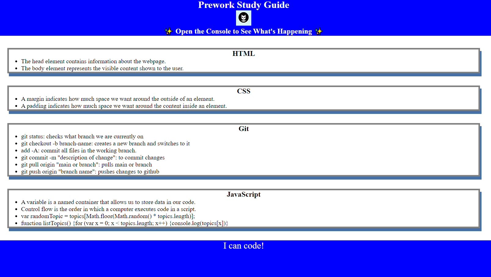

# Prework Study Guide Webpage

## Description

This website was created as a prework for the bootcamp, it was developed to have a better understanding about HTML, CSS, JS and how they communicate with each other
to create a dynamic website. The purpose of the website is for the student to practice using gitbash, github, and visual studio. Website will be live as it will get updated 
by new lessons learned or as a cheat sheet for code.

## Installation

N/A

## Usage

This website will be used as a study guide for the student. Notes and code "cheat sheet" will be used to update what was learned for each language: HTML, CSS, and JavaScript. On the website Chrome DevTools can be used to try different code to see how the website is modified and also to see JS code running. DevTools can be accessed by clicking on CTRL+Shift+I. 

The following is a screenshot of the website.

## Credits

N/A

## License

Refer to LICENSE.md in the repo.
